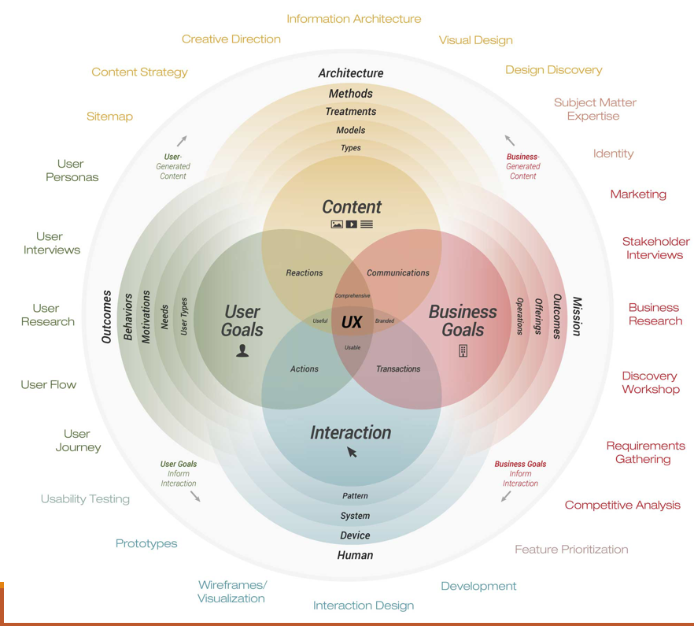
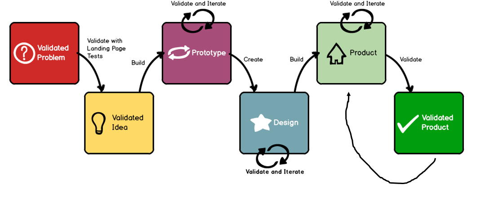
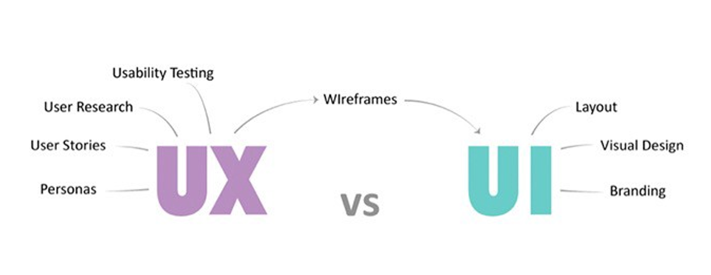
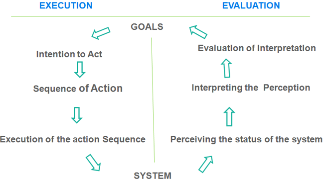

# Journey_to_Design

This is a notetaking repo for anything design. UI design, UX design, graphic design.

To-Do:
* Read UX books
* Read dark pattern

DISCLAIMER: This repo contains copyrighted material the use of which has not always been specifically authorized by the copyright owner. In accord with the purpose of notetaking/search/retrieval in an easy way and convenient way, we are making such material available to advance understanding of UX design, UI design, and graphic design. We believe this constitute a "fair use" of any such copyrighted material as provided in Section 107 of the US Copyright Law. In accordance with Title 17 U.S.C Section 107, the material on this site is distributed without profit to those who have expressed a prior intereste in receiving the included information for research and educational purposes. For further information on fair use, go to https://www.law.cornell.edu/uscode/text/17/107    
If you wish to use copyrighted material from this site for purposes of your own that go beyond fair use, you must obtain permission from the copyright owner.

## UX Design

* Books: [Don't Make me Think: A common Sense Approach to Web Usability, by Steve Krug](https://www.amazon.ca/Dont-Make-Think-Revisited-Usability-ebook/dp/B00HJUBRPG/ref=sr_1_1?dchild=1&keywords=don%27t+make+me+think&qid=1594675115&sr=8-1), [Lean UX: Applying Lean Principles 7to Improve User Experience by jeff Gothelf, Josh Seiden](https://www.amazon.ca/Lean-UX-Designing-Great-Products-ebook/dp/B01LYGQ6CH/ref=sr_1_1?crid=2MSSN8WMNZMJE&dchild=1&keywords=lean+ux&qid=1594675180&sprefix=lean+UX%2Caps%2C208&sr=8-1), [Smashing UX Design: Foundations for Designing ONline User Experiences, by Jesmond Allen, James Chudley](https://www.amazon.ca/Smashing-Design-Foundations-Designing-Experiences/dp/0470666854/ref=sr_1_1?crid=MBN11AGAZW3E&dchild=1&keywords=smashing+ux+design&qid=1594675246&sprefix=Smashing+UX+design%2Caps%2C284&sr=8-1), [The Design of Everyday Things by Don Norman](https://www.amazon.ca/Design-Everyday-Things-Revised-Expanded/dp/B07L5TBRRG/ref=sr_1_1?crid=Q58VZNOCLYFW&dchild=1&keywords=design+of+everyday+things&qid=1594675367&sprefix=design+of+ever%2Caps%2C207&sr=8-1)
* What is Design by Dieter Rams: Innovative, useful, aesthetic, understandable, unobstrusive, honest, long-lasting, thorough and thoughtful, environmentally friendly, less is more
* There is no such thing as an objectively good user interface: quality depends on the context: who the user is, what he/she is doing, what their motivation are; 2. Applying a set of one-size-fits-all principles makes user interface creation easier, but it **doesn't necessarily make the end result better**
* Bad design is easier to spot than good design: We mostly don't notice the good design--only when it's bad

## Startup and Entrepreneurship
* Entrepreneur: Entrepreneurship is the pursuit of opportunity without regard to resources currentrly controlled. Howard Stevenson, Process of starting a business or an organization-done by an entrepreneur, process: develop business model, acquire resources; design, build, iterate
* A startup is an idea in search of a business model. 2. Newly created, in a phase of development and research for a given market; 3. There's also lean startup, idea created by Eric Ries in 2011, an attempt as shortening the process by validating the product early. 4. Business-hypothesis-driven experimentation; iterative product releases; validated learning--try idea, measure effectiveness
* Startup common mistake: 1. building before validating, 2. creating a solution and then looking for a problem for it; 3. Not identifying who the customer/user is; 4. Not checking whether it's feasible or not
* Value Proposition: In order to create a startup, need an idea: formalize the idea with a value proposition
* Value Proposition; A promise of value a customer/user will receive by choosing your product/service over others; 2. explain how product/service solves customer problems; 3. has a headline, sub-headline(or a two-to-three sentence paragraph); 4. list benefits and/or features
* Don't be "better", "faster", "cooler", be unique
* Example: K-12 student who receive awards such as sport trophies and graduate certificates record the moment with photos and trophies which don't always capture the feeling, detail, or personalization of the event. Memento 3D creates photorealistic 3D sculptures of your children in their moment of celebration such as winning the tournament, being the most valuable player, or graduating. Memento 3D records on location and ships your three dimensional rendition to you; offering a keepsake that will immortalize the moment in a way that a photograph or trophy can never do.

## Validating Assumption
* "People don't want to buy a quarter--inch drill. They want a quarter-inch hole!"--Theodore Levitt, American economist, professor at Harvard Business School
* Why validate: Making new products is based on assumptions(Your assumption may be wrong; try and poke holes in it); 2. will save you money and time-if you are wrong(fail fast, fail often); 3. get you in touch with you users; 4. will help you figure out if you have something of value to others.
* Validate: 1. market/demand (need to ensure a large enough demand. ie.solve a big enough problem); 2. Problem/pain point (find real users--don't use family/friends); 3. product: final step, iterative
* How to validate? 1. Talk to potential customers: real users--not family/friends; informal interview, ask lots of open ended questions; look for patterns, how do they address (if at all) pain point; 2. Create landing page: website that attracts potential users: use google adwords, facebook ads, etc. to draw potential users in; use analytics to track potential user interest; 3. industry reports; 4. Look at competitor offering: and try and make accurate guess of pricing/revenue numbers; 5. Look at traffic for competing sites/products; 6. use search trends (e.g., Google Trends) to see interest; 7. Build a minimum viable product (MVP): Highest ROI vs risk, core features, nothing fancy; 8. Set up minimum criteria for success: e.g., "I expect x number of people out of the y number of people in the experiment to exhibit behiavor z"

Overview of validation process:

#Heuristics:
Do's: 1. Get out of the building/get away from the computer; 2. Think big, start small; 3. Choosoe differentiation vs. derivative; 4. Test your hypothesis; 5. Create and experiment with a Minimum Viable Product(MVP); 6. Be ever willing to change your thinking/idea (Don't be afraid to admit what you have sucks)
* Don't's: Believe "if you build it, they will come"(that only works in the movies); 2. Insist that it will "go viral"; 3. Think that you won't have competition; 4. Build a <insert product name> killer; 5. Rely on only needing a small percentage of a large market; 6. Confuse an idea with a company; 7. Insist that it has to be "cool"

## UX Design Overview
* About UX design: 1. is inherently creative/artistic, 2. very unpredictable, 3. user centred, 4. blends technical feasibility with creative sense (design and technology together--enbrace it), 5. creates a narrative for the user experience, 6. includes UI design, and so much more, 6. A process-not a state, 7. Non-hierarchical: Not bottom-up or top-down; 8. Radically transformational: agile/iterative/lean; prototyping is a must; 9. embracing discovery: New goals/features/ desires/wants/directions/scope; 10. Find out what users are trying to achieve; 11. What similar systems have they used that make them feel good using them; 12. Learn about the users' behaviors, motivations; 13. Get at the requirements of what needs to be designed;
* Think bigger than: "what's wrong with the current app/site?"

## UI vs. UX
* UX design is: 1. field research, user interviews, user testing; 2. gathering/organizing stats, creating personas; 3. creating user stories, creating customer journey maps; 4. product design, feature/requirements gathering; 5. graphic art, interaction design, information architecture; 6. Usability design/testing, prototryping, UI design/layout; 7. Visual design, taxonomy/terminology creation; 8. Copyrighting, presenting, integrating with S/W developers, 9. Brainstorming, design culture evangelism
* UX design vs. HCI: UX design is 1. adaptive vs predictive; 2. user centered (like agile methodology), 3. industry driven, 4. human centered practice. Human-Computer Interaction(HCI) is: 1. academic research driven, exploratory engineering, 2. cognitive science, attempts to formalize methodology, 3. predictive, not always with practical application

## Intro to Agile Methodology
* A methodology for project management. Usually in software engineering/development. But can be used in other disciplines
* characteristics: 1. emphasis on collaboration; 2. Self-organizing teams; 3. cross-functional teams: group memebers coming from different disciplines, eg. software engineers, UI desingers, UX designers, artists, etc; 4. adaptive planning ( inspect and adadpt philosophy); 5. embracing change--and postiively responding to it(even late in the process/project life cycle); 6. working towards early, or in the very least, on time delivery; 7. working product delivered frequently; 8. attention paid to design on all levels; 9. very short feedback loop, short daily meeting, adaption cycle; 10. user centered; 11. incremental; 12. frequent communication; 13. Deliveries are short-term: i.e.,1-4 weeks; 14. entire team is responsible for managing the team: not just the project manager's

##### Tools:
1. adobe XD
2. Figma
3. FluidUI

## Week 2: User Survey & Interview
* Before you start asking...: It is hard to ask questions when you don't know what you're looking for... Before you start coming up with your survey/interview questions, ask yourself what information are you looking for, and from whom? **What is your objective?**
* Types of questions: Two main types of questions: open ended, closed ended
* Open-ended: free flowing, not leading, usually at the ned of the survey
* closed ended: Three types. Rating scale, multiple choice, rank order
* Open-ended pro: give qualitative responses, discovery of new ideas, gives the "why" for a given topic
* Open-ended cons: Time consuming for respondent/analyze/compile data; 2. if done wrong (e.g., leading), answers may not be useful. Eg. "What is your opinion on social media" (This is leading)
* Closed-ended pros: quick; doesn't require a large amount of effort from the participant; good for showing quantitative data;
* Closed-ended cons: hard to dig deep and get meaningful information

### User Interview
* Why?: validation of product **Very important**, ask why...and keep asking it
* Common research technique: To gather qualitative info from existing/potential users
* Performed by one or two (two is best)
* questions cover topics such as users': background, occupation, use of technology, goals, motivations, pain points
* useful for: 1. later use in creating personas, 2. validating features, the product, the market
* How to find your interviewees? User group/Special Interest Groups (SIGs), analytics, market research, networking
* Create your interview script with questions you want to ask. And go over it yourself before conducting the interviews
* Tips on conducting user interviews: 1. Let interviewees know why you are interviewing them. 2. Don't ask leading questions. e.g.,(bad)"how often do you use Facebook", e.g.(good)"Do you use any social media networks"
* Use the script as a guide for questions. Not as a "bible", allow for improvisation within the interview--especially if the conversation goes into an interesting area
* Keep it to less than an hour: 20 minutes is plenty in small projects
* Leave time between interviews--it's an exhausting task
* one team member takes notes, one ask questions--taking notes is so very important! Bullet point is fine, be concise but get all of what's being said
* Record your interview. So that later you can go back and make further notes
* Perform the interview in an environment that's not distracting. No babies crying, sirens blaring, people interrupting, etc
* Dress to the level of the interviewee
* Make interviewee comfortable: Be cordial, offer refreshments if possible
* Keep it on track--don't let them go off on tangents: unless those tangents are relevant to the questions/product
* Maintain eye contact: Don't bury yourself in the notes

* The 5 Why's Techniques
* Protip: Instead of using "why", soften it with "what" or "how". It will seem less interrogation-like
* eg. Why do you eat out? vs. What's the reason for your eating out habits?

### Contextual Interview
* Interviewing potential/current users in the environment in which they will use the product
* Useful in determining: 1. distraction(i.e., possible pain point): noisy, interruptions, bad Wi-Fi signal, cramped, dark, hot, dusty; 2. Personality clues (ergo personas): e.g., messy environment, organized, dark, light, noisy, disruptive; 3. The technology: Type of computer (e.g.,mobile,laptop, desktop, etc);4. Workarounds: e.g., post its with instructions, USB memory stick, etc
* Analysis of Finding for Interviews: 1. After interviews, you should have: tons of notes, audio recordings; 2. Do the following: listen to the audio recording, and take notes; reread the notes taken, and annotate them; create mind maps

### Survey
* Survey help: offer quantitative results. (1. Validation of product...remember? 2. Most of the rest of UX winds up being qualitative)
* Online survey tools: SurveyMonkey, Typeform, JotForm, AskNicely, Formstack, Surveygizmo, Google Forms
* Offline tools: printed paper
* Process: 1. Clarify the purpose (i.e., what should be studied?) 2. Formulate survey goals: What are the aims? participants? Target population? How long? 3. Verify budget (i.e., time, money); 4. Choose survey method (i.e., online, offline), 5. Choose sampling (e.g., random, quota), 6. write and administer survey; 7. analyze and interpret survey results
* Screener questions: Because of the nature of survey, it is always a good idea to have screener questions. There are questions that help you weed out participants who are not in your target demographic. Questions like age, gender, profession, or whether or not they use certain products can all be suitable screener questions. Ideally you should have 1-3 screener questions in your survey.
* Survey online or offline?? Online benefit: Online tools offer many features, can tie in with social media, can reach large audience. Online shortcomings: If anonymous, majority of people contact won't respond. Offline benefits: It's harder to say "no" to a survey when handed on. That's social engineering. Offline shortcomings: Compile results can be very time consuming

### Rating Scale questions
* Two (commonly used) types: Likert-type, semantic differential
* Likert-type scales (ordinal): usually limited to a five-category scale, ordinal level
* Opinion and attitudes: "How much do you agree with..." possible answers: strongly agree, agree, neither agree or disagree, disagree, strongly disagree
* Frequency: "How often do you..." Possible answers: always, often, sometimes, rarely, never
* Quality: "In general, how do you rate the quality of..." Possible answers: excellent, very good, good, fair, poor
* Importance: "How important would you say {topic} is...": possible answers: very important, important, somewhat important, not at all important
* Semantic differential scales (ordinal or interval): 1. each end marked with opposing statements; 2. scale with an odd number of categories allow for neutrality (e.g., neither agree or disagree); 3. Scales with an even number of categories force respondents to make a choice: Called a "forced question"

#### Level of measurement
* Ratio: absolute zero (highest)
* Interval: distance is meaningful (2nd highest)
* Ordinal: attributes can be ordered (3rd highest)
* Nominal: attributes are only named; weakest

# Multiple Choice Questions
* select one or more answers from a list.
* Easy to answer, easy to compile/analyze results
* Special case of multiple choice: Dichotomous: choose one of two choices. Useful for determining if respondent is suited to responding to the next question--called a filter/contingency question. (Use filter questions sparingly!)
* e.g.: I enjoy eating ice cream at Fictionals. True/False. Do you like eating ice cream at Fictionals? Yes/No

# Rank Order
* Respondents must place each item in an order of: Importance/interest/prominence
* Useful to show what respondents like the most/least
* e.g., How would you rank the following pizza franchises? Press and hold your mouse on any franchise, and drag it up or down to change its rank. Pizza hut, papa John's. Little Ceasars. Domino's. Papa Murphy's

#### Question Wording
* Each question should have a defined focus. E.g., do you use Wi-Fi with your smart phone?
* Avoid: using double-negative, highly-emotional connotation
* Biased/leading questions--which can skew your results
* Be brief, concise
* Vary the types of questions--to increase engagement
* Be mindful of different interpretations of similar words

###### Resources
* http://www.canadabusiness.ca/eng/page/2685/
* https://infoactive.co/data-design/ch04.html
* http://www.survio.com/en/blog/tips-and-tricks/how-to-create-a-survey-survey-question-types#.VLNltnvYyUI
https://explorable.com/surveys-and-questionnaires
* http://www.qualtrics.com/university/researchsuite/basic-building/editing-questions/question-types-guide/rank-order/
* http://theuxreview.co.uk/user-interviews-the-beginners-guide/

# Week 3: Personas, User Stories, DITL, Customer Journey Maps
* Organizing your data: So now that you have some data, now what?---We want to be able to identify themes and patterns in order to create a user persona

#### Affinity Diagram
* Affinity diagrams are a way of organizing large amounts of data froma variety of sources
* Uses mostly sticky notes (usually on some sort of whiteboard or clean wall)
* Can be done individually or as a team
* Start by writing your data down onto sticky notes (1 piece of data per sticky note)
* Set a timer for 5-10 minutes and start putting your post-it notes onto your wall: If this is done as a team, make sure no one is talking until the discussion part
* Organize common sticky notes together into group of 4 - 10 items (duplicates okay)
* As groups are formed, create a label (usually in a sticky note of a different color) and give a heading to your new group
* Do this until the timer runs out, then if you are in a team, discuss, and move sticky notes around as necessary
* Repeat as necessary
* A good tool to use online is Google's Jamboard

#### Personas
* What is a persona? An archetype of a type of user--an example of the type of person that would interact with the system (archetype: pattern of behavior)
* Not a hypothetical customer invented by the marketing
* Personas can span demographics
* They identify user motivations/expectations/goals
* They are fictional characters. But are based on real data and research of a problem domain
* Personas include: social/demographic characteristics; needs, desires, goals; cultural backgrounds, motivations, age, gender, occupation, hobbies; personalities; likes, dislikes; even a photo to bring the persona to life
* Personas answer very specific questions... Examples: Which information is necessary at which point of the day? Is the user concentrate on only one thing at a time? Does the user have frequent interruptions during their experience? Why is he/she using the product? What motivates him/her to use this specific product over a competitor's?
* Benefits of personas: Users' goals/needs become focus for team effort; each persona represents the needs of several/many users: focusing team's effort; relatively quick to develop; help avoid building what users ask for: instead of what they will actually use; prioritization can be done based on personas: e.g., the online persona, the HR persona, etc; reduce the frequency of usability tests
* Personas from research: Interviews, interviews, interviews... remember? Take the data from the interviews and: look for patterns of attitude and behavior. E.g., frequent travelers price driven and not quality driven. / Look for clusters of attitudes and behaviors that make up different personas. E.g., the frequent traveler that is skilled in researching holidays. Create personas and give them profile info, characteristics, etc

#### How to create a persona:
1. State profile: age, profession, marital status, ethnicity, languages spoken
2. Characteristics: Hobbies, personal interests, lifestyle choices, personality details
3. Pain points: Things that make them dissatisfied/unhappy/uncomfortable
4. Needs: Things that they feel are important to them in a given scenario

###### Example
* Mary
* Profile: 30 years old; works for a magazine(successful professional); single
* Characteristics: attends lots of media events; has laptop, 2 smartphones (work + personal)--very comfortable with technology; uses social media for personal and work; lots of knowledge of fashion and retail; travels a lot; drives her own high-end car; lives in an upscale apartment; extensive wardrobe; buying high-end is a special "treat", she'll spend time on it and research
* Pain points: wants to be treated as "special"; not just any other customer; doesn't want to go hugely out of her way or not have help available; wants to get the very best out of her money; doesn't know exactly what she wants, but she knows quality;
* needs: associate should greet her and know: -name, size, buying profile, previous purchases and offers; needs to be able to let the store know she's coming in--at point of decision to go; needs info on what she's buying: where it's made, materials, etc. Need to research the stock fromm home--know if it's in store

### User Stories
* Are short statements that include the: Role of the user; and the activity that they wish to perform
* They tell a very simple, tell a story.
* They are associated with a persona
* Format: As a <role>, I want <goal/desire> [so that <benefit>]
* "so that" is important as it is a method of validating the need
* Ex1: as a inside salesmen, I want to search for my customers using first and/or last name so that I can look up their contact info
* Ex2: As a games player, I want to quickly see which of my friends are playing the same game as me so that I can invite them to my game session
* As a mobile phone user, I want to track my child's SMS usage on a daily, weekly, and monthly basis so that I can determine if they going over their plan SMS limit
* Theming user stories: once user stories have been generated: create grouping of like task. Useful to get an initial idea of the overall product's features
* prioritize user stories: So as to come to an agreement of the overall goals of the products
* benefits: 1. encourage deferral of collecting details; 2. break project into small increments: this makes it easier to estimate/implemtn developer/design effort; 3. extreme brevity: which fits into the UX design & agile methodology of having as little doc as possible; 4. tease out features; 5. easy to priortize (e.g., use post it notes); 6. easy to understand by all parties (including clients with little/no tech savvy)

### DITL
* Day in the Life (DITL)
* A step-by-step/play-by-play summary
* Limited to a time frame within a day: based on a persona
* Useful for: 1. finding possible features for the product; 2. identifying further pain points for personas; 3. helping validate the features for the product; 4. creating presentation material for the client/executive: to show how the product will work

###### Example of DITL
* Mercedes on a weekend
1. 8am: mercedes wakes up in her condo, makes coffee, checks facebook and the news on her laptop
2. 8:30am: she gets a newsletter (in her email) about the new line of Britney Broden Boots
3. 10am: she checks her bank account to see if her paycheck has come in
4. 10:30am she goes to the Britney Broden website, look at their boots, favorites 2 of them
5. 11am: she looks at other high-end stores and favorites more shoes, clothes, and accessories
6. 11:15am she gets dressed up and heads out
7. 12:30pm: she meets a friend for lunch, they eat and split up
8. 1:30pm: she's gone for lunch near the high street and walks there to go shopping
9. 2pm: she window shops, pops into a few stores, doesn't buy anything
10. 2:15pm: she goes by the Britney Broden store, goes in
11. 3pm: she's greeted by the sales associate, but decides to browse on her own, because she's looking for the two boots she saw online, but doesn't remember the name of them
12: 3:15pm she looks for the two pairs of boots and finds them on her own, then asks the sales associate for her size

### Customer Journey Map
* A diagram that illustrates the steps your users go through in engaging with your app/business: be it product, online/retail experience, service or any combination
* Can look at entire arc of engagement: or a subset that is causing problems/issues
* maps user experience across all touchpoints: touchpoint: when a (potential) user comes in contact with your brand--before, during, or after they perform a transaction with your product
* Touchpoint examples: 1. before purchase: social media, rating/reviews, word-of-mouth, ads/marketing; 2. during purchase: store/office, website, catalog, promos, staff, phone, POS; 3. After purchase: billing, transaction/marketing emails, support, online help, thank you's; 4. Find touchpoints by using personas/user stories
* useful because: 1. it identifies potential problems/issues with the service/app: e.g., company/organization functional silos lack communication; 2. It helps improve "moment of truth": whether the customer/user has a good or bad impression
* CJM characteristics: use infographics: can vary quite wildly: depending on the project/team/UX

###### Resources
* http://www.steptwo.com.au/papers/kmc_personas/
* http://www.ux-lady.com/diy-user-personas/
* http://www.measuringusability.com/blog/personas-ux.php
* http://uxmag.com/articles/personas-the-foundation-of-a-great-user-experience
* http://www.agilemodeling.com/artifacts/personas.htm
* http://www.executivebrief.com/software-development/waterfall-rup-agile/
* http://www.ux-lady.com/introduction-to-user-personas/
* http://www.smashingmagazine.com/2014/08/06/a-closer-look-at-personas-part-1/
* http://blogs.hbr.org/2010/11/using-customer-journey-maps-to/
* http://www.customerchampions.co.uk/customer-journey-mapping-cjm/
* https://www.surveymonkey.com/blog/en/identify-customer-touchpoints/
* http://blogs.ijento.com/customer-journey-maps/
* http://blog.hubspot.com/marketing/how-to-tailor-your-seo-strategy-to-your-customer-journey
* https://medium.com/@jonatisokon/a-framework-for-user-stories-bc3dc323eca9
* https://www.interaction-design.org/literature/article/affinity-diagrams-learn-how-to-cluster-and-bundle-ideas-and-facts
* https://cxl.com/blog/customer-journey-maps/

# Week 4: Usabilty Heuristics & Anti-pattern
* usability Heuristics: Usability inspection based upon some set of industry-tested heuristics
* involes evaluations of an app/site: test to see if the app/site violates the usability heuristics
* Jakob Nielsen's heuristics: Most widely/commonly used/accepted; formalized in 1994 in his book "Usability Engineering"
* Useful as a starting off point for UI design: done in early stages of design; not meant to replace user testing

1. Visibility of system status (i.e., feedback); system should always keep users informed about what is going on.
 E.g., 1. password strength: strong; 2. your password has been emailed
 2. match between the system and the real world: speak the users' language--words/phrases/concepts: info appear in natural/logical order, concepts familiar to the user/rather than system-oriented terms; using icons are great for giving visual indications. Example: a dropdown menu with the corresponding icon for each item
 3. User control and freedom: be forgiving, let users back out of actions, don't punish for mistakes. i.e., need a clearly marked "emergency exit" to leave the unwanted state; without having to go through an extended dialogue; support undo/redo
 4. Consistency and standard: follow conventions/guidelines, don't make users guess: make words/actions/situations consistent
 5. Error prevention: error messages: good, careful design: better---avoid error prone input (e.g., date picker instead of text typed; ex2: primary button for submit, a link button for cancel)
 6. Recognition rather than recall: minimize user's memory load; make objects/actions/options visible: users shouldn't have to remember info from one page to another; visible instructions replace typed input with formatted values
 7. Flexibility and efficiency of use: accelerators for experienced users. Ex: hotkey shortcut
 8. Aesthetic and minimalist design: don't display irrelevant/rarely used info: extra info detracts from importance; Respected principles of: contrast, repetition, alignment, proximity
 9. Hep users recognize, diagnose, and recover from errors. Error messages expressed in plain language (no code). Precisely indicate problem, constructively suggest solution. Ex. error message around the form
 10. Help and documentation: shouldn't need but if provided, make it useful, easy to search. Info architecture a must. Ex: question mark hover      

#### Heuristics Evaluation
* Heuristic evaluation involves having a small set of evaluators examine the interface and judge its compliance with recognized usability principle (the "heuristics") --Jakob Nielsen
* Using Jakob's list, see if there are deficiencies
* Not one but several evaluators inspect and summarize their findings, and discuss and share their findings
* Heuristics evaluations should not be used to replace user testing: They should be used in conjunction with user testing--a starting off point. Then to usability testing with users (and many times)
* Step by step: 1. define scope--what are you inspecting? Whole site/app? A given action? 2. Know thy users--adopt same POV as your users (i.e., personas); 3. Decide on the UH set--e.g., Jakob Nielsen's; 4. Evaluate experience/Identify issues--perform predefined tasks (e.g., login); 5. Analyze/present results--create list of issues/problems

### Seven Stages of Action
* By Donald Arthur "Don" Norman. (Co-founder and consultant with the Nielsen Norman Group)
* Seven stages of action is: explaining the psychology of a person behind the task performed by him or her
* There are stages of: execution; evaluation

1. Forming the goal: something to be achieved, e.g., "make a nice meal"
2. forming the intention: goal must be transformed into intentions. Specific statement of what has to be done to satisfy the goal. E.g., "make a chicken casserole from fresh ingredients"
3. Specifying an action sequence. What is to be done--the precise sequence of operators that must be performed to effect the intention. e.g., "chop up vegatables, air-cool chicken, boil noodles..."
4. Executing an action. Actually doing something. Putting the action sequence into effect on the world. E.g., chopping vegetables, cooking meat, boiling stock
5. Perceiving the state of the world. Perceiving what has actually happened. E.g., the experience of smell, taste, and look of the prepared meal
6. Interpreting the state of the world. Trying to make sense of the perceptions available. E.g., putting those perceptions together to present the sensory experience of a chicken casserole.
7. Evaluating the outcome. Comparing what happened with what was wanted. E.g., did the chicken casserole match up the requirement of "a nice meal"

* seven stages of action practical application: how easily can one: 1. determine the function of the device. 2. understand what actions are possible; 3. determine mapping from intention to physical movement; 4. perform the action; 5. recognize what state the system is in; 6. recognize if a system is in desired state; 7. determine mapping from system state to interpretation

#####principles of good design:
* visibility: by looking, the user can tell the state of the device and the alternatives for action.
* A good conceptual model: The designer provides a good conceptual model for the user, with consistency in the presentation of operations and results and a coherent consistent system image
* good mapping: it is possible to determine the relationship between actions and results, between the controls and their effects, and between the system state and what is visible;
* feedback: the user receives full and continuous feedback about the results of actions

###### Dark pattern
* Coined by harry Brignull
* What are dark patterns? UX/UI choices that are carefully and meant to trick users into doing things. (Things that they did not set out to do. Buy insurance, create an account, give personal information)
* Dark patterns are intentional. They are also everywhere
* userinyerface.com
* ex1: bait and switch: user set out to do one thing, but different/undesireable thing happens instead. Ex: ads hotel shows up at the beginning of the search result
* ex2: disguised Ads: adverts that are disguisded as other kinds of content or navigation, in order to get users to click on them
* ex3: Fareway bill: hide details of service charges using online bill to obfuscate the info
* ex4: forced continuity: user is not given easy or adequate reminder for canceling a service that automatically opted in the user
* ex5: force disclosure: user is required to provide/disclose extensive personal info for a free/low cost action/service
* ex6: friend spam: site/app asks for user's social media credential for login and uses contact to spam
* ex7: hidden costs: hidden costs incurred in the last step of a transaction
* misdirection: the attention of the user is focused on one thing in order to distract its attention from another
* price comparison prevention: the attention of the user is focused on one thing in order to distractits attention from another
* Privacy zuckering: creating deliberately confusing jargon and user-interfaces which trick your users into sharing more info about themselves than they really want to
* Roach motel: make it easy to get into a certain situation, hard to get out. E.g., email newletter un-subscription
* Road block; when the user's progress t o task completion is restricted or stopped by something else on the screen
* Sneak into basket: user attempts to purchase/ download specific item but the site sneaks an additional item into the shopping cart
* Trick questions: user is required to respond to a question that looks as if it says one thing but actually says something opposite

###### Resources
* Usability heuristics
* http://www.nngroup.com/articles/ten-usability-heuristics/
* http://uxbert.com/designing-usable-interface-nielsens-10-usability-heuristics/
* http://designmodo.com/usability-heuristic-evaluation/
* http://designingwebinterfaces.com/6-tips-for-a-great-flex-ux-part-5
* http://designmodo.com/usability-heuristic-evaluation/
* Seven stages of action
* http://www.it.bton.ac.uk/staff/rng/teaching/notes/normangulfs.html
* https://en.wikipedia.org/wiki/Seven_stages_of_action
* Dark Patterns
* http://darkpatterns.org/
* http://www.90percentofeverything.com/2013/07/23/the-slippery-slope/
* http://www.theverge.com/2013/8/29/4640308/dark-patterns-inside-the-interfaces-designed-to-trick-you
* http://www.90percentofeverything.com/2009/04/16/five-ux-antipatterns-to-avoid-when-designing-log-in-registration-areas/
* Others
* https://www.nngroup.com/articles/ten-usability-heuristics/
* https://www.youtube.com/watch?time_continue=337&v=kxkrdLI6e6M&feature=emb_title

# Week 5: User flows, navigation, wireframes & Protyping, storyboarding
